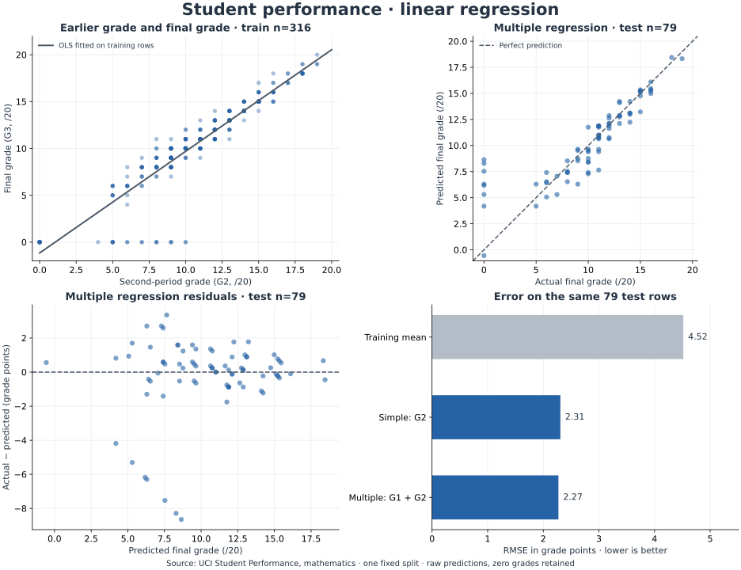

# Student Performance Regression

**A data science project by Aazim Ashraf · Python + R · Simple and multiple linear regression**

How well can earlier assessment grades predict a student's final grade? This project compares a training-mean baseline with two ordinary least squares models, using the same training and test records in Python and R.

The bundled mathematics dataset contains **395 records** from the [UCI Student Performance dataset](https://archive.ics.uci.edu/dataset/320/student+performance). These are Portuguese secondary-school records, not IUST data. See [data provenance](data/README.md).



## What this project demonstrates

- Loading and validating a real CSV dataset.
- Splitting records before fitting a model.
- Comparing a baseline, simple regression, and multiple regression.
- Evaluating unseen records with MAE, RMSE, and R².
- Reading coefficients and inspecting prediction errors.
- Checking the same calculation in Python, R, and NumPy linear algebra.

## Results

One fixed split: **316 training records and 79 test records**. All final grades of zero are retained. Predictions are evaluated without rounding or clipping.

| Model | Inputs | MAE ↓ | RMSE ↓ | R² ↑ |
|---|---|---:|---:|---:|
| Training-mean baseline | Constant training average | 3.3644 | 4.5177 | −0.0035 |
| Simple regression | G2 | 1.3624 | 2.3076 | 0.7382 |
| Multiple regression | G1 + G2 | 1.3448 | 2.2721 | 0.7462 |

MAE and RMSE are measured in grade points on a 0–20 scale. The multiple model's **MAE of 1.34** means its absolute errors average 1.34 grade points on these 79 records; individual errors can be larger. Its R² of 0.7462 is **not 74.62% accuracy**.

Adding G1 produces a small improvement on this split. That does not establish a reliable improvement across new populations. The larger RMSE relative to MAE reflects some substantially larger errors; inspect the residual plot.

Exact outputs: [Python metrics](reports/python/metrics.csv), [R metrics](reports/r/metrics.csv), [test predictions](reports/python/predictions.csv), and [coefficients](reports/python/coefficients.csv).

## Run with Python

Install Python 3.12 and open a terminal in the extracted project folder. The data is included, so analysis needs no data download.

```bash
python -m venv .venv
```

Activate it on macOS or Linux:

```bash
source .venv/bin/activate
```

Or activate it in Windows Command Prompt:

```bat
.venv\Scripts\activate.bat
```

Then run:

```bash
python -m pip install -r requirements.txt
python python/regression.py
python python/predict.py --g1 12 --g2 14
```

If your computer uses `python3`, use `python3` for the first command. After activation, `python` points to the environment.

The example predicts **13.87 / 20**. The command prints a raw OLS prediction and explains if it falls outside the grade scale.

For a guided notebook, open [the walkthrough](notebooks/linear_regression_walkthrough.ipynb). Its cells and outputs are included. To run it locally, install Jupyter in the same environment with `python -m pip install notebook`, then run `jupyter notebook` and select the file under `notebooks/`.

## Run with R or RStudio

R is an independent alternative; it does not require Python or any extra R packages.

1. Open `student-performance-regression.Rproj` in RStudio. This sets the project folder as the working directory.
2. Run this in the R console:

```r
source("R/analysis.R")
```

Or use a terminal from the project root:

```bash
Rscript R/analysis.R
```

Results appear in `reports/r/`, including a model summary and four training diagnostic plots in a PDF. The training R² in `model_summary.txt` is different from the held-out R² in `metrics.csv` because they evaluate different records.

## Models and inputs

| Field | Meaning | Role |
|---|---|---|
| G1 | First-period grade | Input to multiple regression |
| G2 | Second-period grade | Input to both regressions |
| G3 | Final grade | Target to predict |

All three use the dataset's 0–20 grading scale.

The model forms are:

```text
Baseline:       predicted G3 = mean G3 in the training records
Simple:         predicted G3 = b0 + b1 × G2
Multiple:       predicted G3 = b0 + b1 × G1 + b2 × G2
```

The fitted multiple-regression equation, rounded for display, is:

```text
predicted G3 = −1.5111 + 0.1188 × G1 + 0.9967 × G2
```

The saved model uses full precision. Coefficients describe conditional associations, not the causal effect of changing a grade.

## Reproducibility and checks

`data/split.csv` fixes the same original row IDs for both languages. It was generated once using NumPy's PCG64 generator with seed 42; the first 79 permuted row IDs form the test set. Changing a seed separately in R would not recreate the same split, so both implementations read this file instead.

The scripts verify the raw CSV checksum before using the row IDs. Do not reorder or edit that source file. Restore it if needed with:

```bash
python scripts/download_data.py
```

After running both implementations:

```bash
python -m unittest discover -s tests -v
python scripts/compare_languages.py
```

Five tests check split separation, preservation of zero grades, OLS against independent least squares, the training-only baseline, saved predictions, and invalid input handling. The comparison script checks coefficients, metrics, and all test predictions between languages to a tolerance of `1e-9`.

The included results were executed using Python 3.12 and R 4.6.0 through WebR. Python package versions and the R session are recorded alongside their outputs. A GitHub Actions workflow is included to rerun the project with Python 3.12 and native R after publication; that hosted workflow has not yet run for this new repository.

## Project files

| Path | Purpose |
|---|---|
| `python/` | Train models, create charts, try a prediction |
| `R/analysis.R` | Equivalent analysis with base R |
| `notebooks/` | Executed Python learning walkthrough |
| `data/` | Original CSV, shared split, attribution |
| `reports/python/` | Metrics, coefficients, predictions, model, data checks |
| `reports/r/` | Matching R results, summary, training diagnostics |
| `reports/figures/` | Regression overview displayed above |
| `tests/` | Mathematical and data-separation checks |
| `scripts/` | Restore the dataset and compare language outputs |
| `docs/` | Beginner explanation and GitHub publishing steps |

## Interpretation and limits

This is a **late-term prediction** exercise: G1 and G2 must already be known. It cannot make a beginning-of-year prediction. UCI highlights that earlier grades are strongly associated with the final grade; this is why the prediction point matters.

There is one small, random test split, no cross-validation, and no independent IUST validation. Some final grades are zero and have large prediction errors. Those observations remain in the analysis. OLS assumes a linear additive relationship and can return values outside 0–20. The residual plots show why classical model-summary assumptions should be examined rather than taken for granted.

Use this project to learn and explain regression. It has not been validated for grading, admission, or intervention decisions.

## What to learn next

Read [the beginner guide](docs/LEARNING_GUIDE.md). For a next experiment, add cross-validation within the training records, or design a separate model that only uses variables genuinely available earlier in the year. Keep a fresh holdout for judging new design choices; do not repeatedly optimize against this test split.

## Attribution and license

Code: [MIT license](LICENSE). Dataset: [CC BY 4.0](https://creativecommons.org/licenses/by/4.0/).

Cortez, P. (2008). *Student Performance* [Dataset]. UCI Machine Learning Repository. [doi:10.24432/C5TG7T](https://doi.org/10.24432/C5TG7T).

Implementation references: [scikit-learn LinearRegression](https://scikit-learn.org/stable/modules/generated/sklearn.linear_model.LinearRegression.html) and [R lm](https://stat.ethz.ch/R-manual/R-devel/library/stats/html/lm.html).
